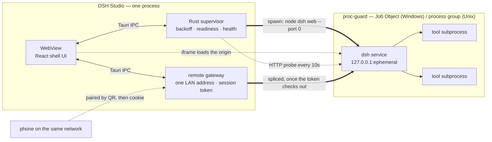

<div align="center">


# DSH Studio

[](https://github.com/Moresyl/dsh-studio/actions/workflows/ci.yml)

**A native desktop shell for [DeepSeek Harness](https://github.com/deepseek-ai/deepseek-harness).**

Rust + Tauri 2. It supervises the local `dsh` service, reclaims every process it
spawns, and never forks the upstream project to do it.

[English](README.md) · [简体中文](README.zh-CN.md)


</div>

---

## Why this exists

`dsh` is a local web service. Running it from a terminal works, but it leaves you
managing a process by hand: finding a free port, noticing when it dies, and
cleaning up the tool subprocesses it leaves behind when it does.

DSH Studio makes that a window. The design goal is that the shell should be
**boring** — it starts the service, keeps it alive, and stays out of the way of
the harness UI.

## What it does

**Supervises, rather than just launches.**
The service runs under a supervisor that restarts it with backoff when it exits.
A restart lands on a new port and the window follows it — no stale bookmarks, no
manual re-launch.

**Notices a service that is alive but wedged.**
Watching the process is only half the job: a server that has stopped answering
still has a live PID, and a TCP connect still succeeds because the kernel
completes the handshake from the listen backlog. So the supervisor sends a real
HTTP request every 10 seconds. Three consecutive misses and the harness is
recycled.

**Reclaims the whole process tree.**
The harness spawns tools, which spawn their own children. On Windows the service
is launched into a [Job Object] with `JOB_OBJECT_LIMIT_KILL_ON_JOB_CLOSE`, so the
kernel tears the tree down even if the shell is killed outright. On Unix it gets
its own process group and is signalled as a group. Closing the window leaves
nothing behind.

**Picks its own port.**
`--port 0` asks the OS for an unused one and the supervisor reads back the port
the service actually bound. There is no configured port to collide with, and no
scan-for-a-free-port race between the check and the bind.

**Installs the harness for you.**
If `@deepseek-ai/dsh` is not on the machine, the row that says so is a button.
It runs `npm install` against a private prefix inside the app's data directory —
invoking `npm-cli.js` through the detected Node binary directly, never through a
shell — and streams the output into the window while it works.

**Hosts the harness instead of replacing it.**
The harness UI is loaded in a frame under the shell's own title bar, so the
window stays movable and closable, and switching to the control panel does not
throw away a running session. Nothing about the upstream project is patched or
vendored.

**Extends it through its own plugin system.**
There is a marketplace in the window: search the npm registry, read what a
package declares before you commit to it, and install into the harness's hosted
profile. Installation goes through the harness's own plugin command rather than
around it — no private side channel into somebody else's config. A package whose
manifest declares a profile patch becomes a layer the harness loads; one that
does not is labelled the plain library it is, instead of appearing as a plugin
that mysteriously did nothing.

**Reaches your phone without putting the agent on the network.**
Remote access is off until you open it, and opening it does not move the
service — `dsh` stays bound to loopback, which is not configurable. What opens is
a separate gateway, bound to one LAN address, holding a 128-bit token minted for
that session. Pairing is a QR code: scan it, the token lands in a cookie, and the
phone is in. Everything after that is spliced straight through to the harness.
Close the door and the token dies with it; the next one is a different secret.

[Job Object]: https://learn.microsoft.com/en-us/windows/win32/procthread/job-objects

<div align="center">

</div>

## How it works

One process owns everything. The Rust side supervises the service and the
WebView renders the shell; the harness itself is loaded from its own origin, so
what you see is the real upstream UI rather than a re-implementation of it.



The startup sequence is worth spelling out, because every step exists to remove
a failure the terminal version has:

1. **Detect.** Every Node on the machine is probed with `--version` — including
   the ones a version manager installed but never put on `PATH`. The newest one
   that meets the minimum wins.
2. **Install, if needed.** `@deepseek-ai/dsh` goes into a private prefix under
   the app's data directory. Nothing is written to your global npm root.
3. **Launch.** The service is spawned into a Job Object (Windows) or its own
   process group (Unix), with `--port 0` so the kernel assigns the port.
4. **Read back.** The supervisor parses the readiness line the service prints
   and learns the port it actually bound. No guessing, no scanning.
5. **Host.** The window loads that origin in a frame, and keeps probing it over
   HTTP. Three consecutive misses and step 3 runs again.

## Install

Grab an installer from [Releases]. Every tagged version is built by CI for four
targets:

| Platform            | Artifact                                                     |
| ------------------- | ------------------------------------------------------------ |
| Windows x64         | `.exe` (NSIS, per-user install — no admin prompt) and `.msi` |
| macOS Apple Silicon | `.dmg`                                                       |
| macOS Intel         | `.dmg`                                                       |
| Linux x64           | `.AppImage`, `.deb`, `.rpm`                                  |

> **macOS builds are not yet signed or notarized.** The first launch will be
> blocked by Gatekeeper; approve the app in System Settings → Privacy & Security.
> Signing is on the roadmap.

You will also need Node.js 20 or newer on the machine — see [Requirements](#requirements).
What changed between versions is in the [changelog](CHANGELOG.md).

[Releases]: https://github.com/Moresyl/dsh-studio/releases

## Status

Early. The Windows path is built and verified end to end; the rest is honest
about being unfinished.

|                                              |                                                                    |
| -------------------------------------------- | ------------------------------------------------------------------ |
| Environment detection, one-click install     | ✅                                                                 |
| Supervisor, backoff restart, health probing  | ✅                                                                 |
| Process-tree reclamation (Windows / Unix)    | ✅                                                                 |
| Harness hosting, log console, English + 中文 | ✅                                                                 |
| Plugin marketplace — search, install, remove | ✅                                                                 |
| Remote access from a phone, paired by QR     | ✅                                                                 |
| Update notice, checked on a schedule         | ✅                                                                 |
| Verified on Windows 11                       | ✅                                                                 |
| macOS / Linux rendering                      | ⏳ not yet run                                                     |
| Bundled Node runtime (no system Node needed) | ⏳ planned                                                         |
| Tray icon, close-to-tray while serving       | ✅                                                                 |
| Native context menus, silent self-update     | ⏳ planned                                                         |
| Packaged releases                            | ✅ automated for Windows, Linux, and macOS (Intel + Apple Silicon) |

## Design notes

Three decisions shape everything else here, and each one gives something up.

**The upstream service is hosted, not forked.** Vendoring the harness into this
repository would buy direct control of its UI, at the price of merging every
upstream release forward forever. Hosting it unmodified gives up that control —
the plan for extending the UI is to go through the harness's own plugin system
rather than around it — and takes upstream updates for free. A plugin installed
from the shell's own marketplace is the supported way to change what the harness
does.

**Shutdown is the kernel's job, not a signal's.** Killing the process you
spawned does not kill the tools it spawned, and on Windows there is no process
group to fall back on — so a shell that crashes can strand a compiler, a test
runner, or a language server nobody can now see. A Job Object makes the kernel
responsible for the whole tree, which is why closing this window is enough even
when the closing was not graceful.

**The service stays on loopback; reach is a separate, authenticated door.**
Binding an agent that can run shell commands to a LAN interface is not something
to do by default, and not something to do without a credential. Remote access is
off until you turn it on, and when you do, a gateway with a per-session token
proxies to a service that never stopped being loopback-only.

## Requirements

- **Node.js 20 or newer.** DSH Studio detects it rather than bundling it, for
  now — see the roadmap above. The harness itself is installed for you.
- Windows 10/11 with WebView2 (present on Windows 11 by default).

## Building from source

```sh
pnpm install
pnpm tauri dev      # run it
pnpm tauri build    # produce installers for the current platform
```

Checks:

```sh
pnpm lint                                          # ESLint, zero warnings
pnpm exec tsc --noEmit                             # strict TypeScript
pnpm test                                          # store and i18n behaviour
cargo test --manifest-path src-tauri/Cargo.toml --workspace
```

## Layout

```
src/                       React 19 + Tailwind 4 shell UI
src-tauri/src/harness/     supervisor, readiness parsing, health probe, install
src-tauri/src/remote/      LAN gateway, session token, QR, address selection
src-tauri/src/plugins/     registry search, profile inspection, install/remove
src-tauri/crates/
  node-runtime/            find a usable Node on this machine
  proc-guard/              kill a process tree and mean it
```

`node-runtime` and `proc-guard` are deliberately free of Tauri and of anything
specific to this app — they are two small crates that answer two questions any
desktop app wrapping a Node service has to answer.

## FAQ

**Does this replace the harness UI?**
No. The harness is loaded from its own service, unmodified. What the shell adds
is the window around it, and everything needed to keep the service alive inside
that window.

**Do I need to install `dsh` myself?**
No. If it is missing, the row that says so is a button. It installs into a
private prefix inside the app's data directory rather than your global npm root,
so nothing on the rest of your machine changes.

**Why does it need system Node?**
Because bundling a runtime is not done yet — it is the next milestone. Until
then the shell finds a Node you already have, including ones installed by nvm,
fnm or Volta that were never added to `PATH`.

**Which port does it use?**
Whichever one the kernel hands out. `--port 0` means there is no configured port
to collide with, and the supervisor reads the real port back from the service's
own readiness line. This is also why a restart can land somewhere else and the
window simply follows.

**I closed the window and the harness kept running.**
That is deliberate, while a service is up. The window hides to the tray and the
service keeps working; the close button says so on hover. Quit from the tray
menu to stop everything.

**Does closing the app leave processes behind?**
It should not, including if the shell is killed outright rather than closed.
That is what `proc-guard` is for. If you ever find an orphan, that is a bug
worth reporting.

**How do I use it from my phone?**
Open the Remote pane, press Open access, and scan the code with the phone's
camera. Both devices have to be on the same network — there is no relay and no
account, so nothing about the pairing leaves the room. The link in the code
carries the session's secret, which is why the pane offers to copy it rather
than print it: paste it into a chat and you have handed over the door key.

**Can I install any npm package as a plugin?**
You can install any package, but only one that declares a profile patch in its
manifest becomes an active layer — the marketplace says which is which before
you install. Plugins land in the harness's own profile through its own plugin
command, so what the shell installs is exactly what the harness would have.

**Is my data sent anywhere?**
The shell makes exactly one request you did not ask for: a GET to this
repository's public release feed, shortly after launch and every six hours
after, to find out whether there is a newer version. No account, no identifier,
nothing about your machine. That is the whole list.

Everything else stays where it is. The service is bound to loopback and that is
not a setting — an agent that can run shell commands has no business being
reachable by default. Remote access does not change it: the service stays on
loopback, and what listens on the network is a gateway that will not forward a
byte without the session's token. It is off until you switch it on, and it goes
off again the moment the harness stops. What the harness itself does with your
API keys is upstream's business, not this project's.

## Contributing

Issues and pull requests are welcome — see [CONTRIBUTING.md](CONTRIBUTING.md)
([中文](CONTRIBUTING.zh-CN.md)) for how to set up, what the checks are, and how
commits are worded here.

The one house rule is in the code style: comments explain _why_ a thing is the
way it is, not what the line below does.

## License

[MIT](LICENSE).

DSH Studio is an independent project. It is not affiliated with or endorsed by
DeepSeek.
