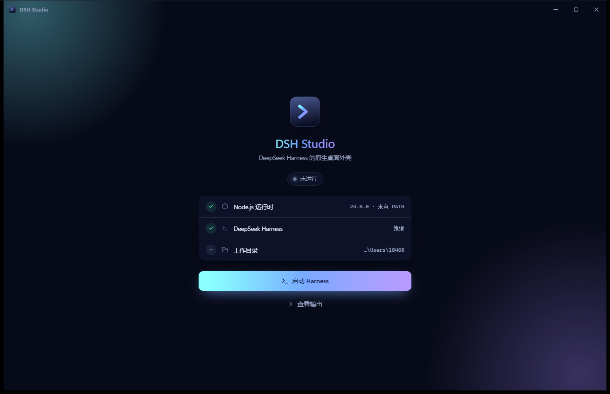
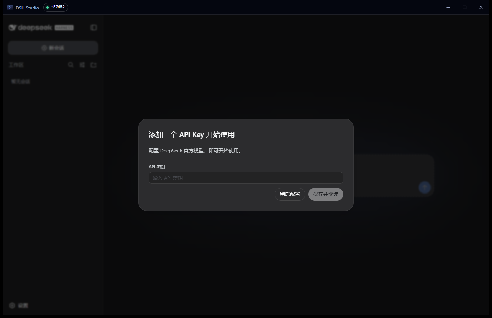

<div align="center">


# DSH Studio

**[DeepSeek Harness](https://github.com/deepseek-ai/deepseek-harness) 的原生桌面外壳。**

Rust + Tauri 2 编写。它托管本地 `dsh` 服务、回收服务派生出的每一个进程，
并且做到这些不需要 fork 上游项目。

[English](README.md) · [简体中文](README.zh-CN.md)



</div>

---

## 为什么做这个

`dsh` 是一个本地 Web 服务。用终端跑它当然可以，但你得自己管这个进程：
找一个没被占用的端口、留意它什么时候挂了、以及它挂掉之后清理它留下的那一堆工具子进程。

DSH Studio 把这件事变成一个窗口。设计目标是让外壳**足够无聊**——
把服务拉起来、让它一直活着，然后别挡着 harness 自己的界面。

## 它做了什么

**是托管，不只是启动。**
服务运行在一个 supervisor 之下，退出后按退避策略重启。
重启会落到新端口上，窗口自动跟过去——不会有失效的书签，也不用手动再拉一次。

**能发现「活着但卡死」的服务。**
只盯进程只做了一半：一个已经不再响应的服务，PID 仍然是活的；
连 TCP 连接都还能成功，因为握手是内核从 listen backlog 里替它完成的。
所以 supervisor 每 10 秒发一次真正的 HTTP 请求，连续三次没有回应就回收重启。

**回收整棵进程树。**
harness 会派生工具进程，工具进程又会派生自己的子进程。
Windows 上服务被放进带 `JOB_OBJECT_LIMIT_KILL_ON_JOB_CLOSE` 的 [Job Object]，
就算外壳自己被强杀，内核也会把整棵树收掉；
Unix 上则单独建进程组、按组发信号。关掉窗口不留任何残余。

**端口自己挑。**
`--port 0` 让操作系统给一个空闲端口，supervisor 再把服务实际绑定到的端口读回来。
既没有需要配置的端口可冲突，也不存在「先扫描再绑定」之间的竞态。

**帮你把 harness 装上。**
如果机器上没有 `@deepseek-ai/dsh`，那一行提示本身就是按钮。
它会在应用数据目录下的私有 prefix 里执行 `npm install`——
直接用检测到的 Node 可执行文件调用 `npm-cli.js`，全程不经过 shell——
并把输出实时打进窗口里。

**是承载 harness，不是取代它。**
harness 的界面加载在外壳自绘标题栏下方的一个 frame 里，
所以窗口始终可拖动、可关闭，切回控制面板也不会丢掉正在进行的会话。
上游项目没有被打补丁，也没有被 vendor 进来。

[Job Object]: https://learn.microsoft.com/zh-cn/windows/win32/procthread/job-objects

<div align="center">

</div>

## 当前状态

还很早期。Windows 这条路径已经端到端跑通并验证过；其余部分如实标注为未完成。

| | |
|---|---|
| 环境检测、一键安装 | ✅ |
| Supervisor、退避重启、健康探测 | ✅ |
| 进程树回收（Windows / Unix） | ✅ |
| harness 承载、日志控制台、中英双语 | ✅ |
| Windows 11 实测通过 | ✅ |
| macOS / Linux 渲染 | ⏳ 尚未验证 |
| 内置 Node runtime（无需系统 Node） | ⏳ 计划中 |
| 托盘图标、原生菜单、自动更新 | ⏳ 计划中 |
| 打包发布 | ⏳ 尚未发布 |

## 环境要求

- **Node.js 20 或更新版本。** 目前 DSH Studio 是检测系统 Node 而不是内置它，
  见上方路线图。harness 本身会由它替你安装。
- Windows 10/11，需要 WebView2（Windows 11 默认自带）。

## 从源码构建

```sh
pnpm install
pnpm tauri dev      # 运行
pnpm tauri build    # 为当前平台产出安装包
```

检查：

```sh
pnpm lint                                          # ESLint，零警告
pnpm exec tsc --noEmit                             # 严格模式 TypeScript
pnpm test                                          # store 与 i18n 行为
cargo test --manifest-path src-tauri/Cargo.toml --workspace
```

## 目录结构

```
src/                       React 19 + Tailwind 4 外壳界面
src-tauri/src/harness/     supervisor、就绪行解析、健康探测、安装
src-tauri/crates/
  node-runtime/            在本机找出一个可用的 Node
  proc-guard/              杀进程树，而且是真的杀干净
```

`node-runtime` 和 `proc-guard` 刻意不依赖 Tauri，也不含任何本应用特有的东西——
它们是两个小 crate，回答的是「任何包装 Node 服务的桌面应用」都绕不开的两个问题。

## 参与贡献

欢迎提 issue 和 PR。唯一的家规写在代码风格里：
注释解释**为什么**这样写，而不是复述下一行在做什么。

## 许可

[MIT](LICENSE)。

DSH Studio 是独立项目，与 DeepSeek 无隶属关系，也未获其背书。
