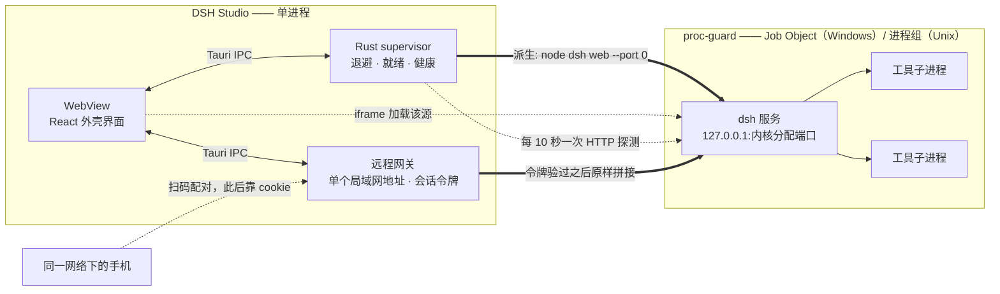

<div align="center">


# DSH Studio

[](https://github.com/Moresyl/dsh-studio/actions/workflows/ci.yml)

**[DeepSeek Harness](https://github.com/deepseek-ai/deepseek-harness) 的原生桌面外壳。**

Rust + Tauri 2 编写。它托管本地 `dsh` 服务、回收服务派生出的每一个进程，
并且做到这些不需要 fork 上游项目。

[English](README.md) · [简体中文](README.zh-CN.md)


</div>

---

## 为什么做这个

`dsh` 是一个本地 Web 服务。用终端跑它当然可以，但你得自己管这个进程：
找一个没被占用的端口、留意它什么时候挂了、以及它挂掉之后清理它留下的那一堆工具子进程。

DSH Studio 把这件事变成一个窗口。设计目标是让外壳**足够无聊**——
把服务拉起来、让它一直活着，然后别挡着 harness 自己的界面。

## 它做了什么

**是托管，不只是启动。**
服务运行在一个 supervisor 之下，退出后按退避策略重启。
重启会落到新端口上，窗口自动跟过去——不会有失效的书签，也不用手动再拉一次。

**能发现「活着但卡死」的服务。**
只盯进程只做了一半：一个已经不再响应的服务，PID 仍然是活的；
连 TCP 连接都还能成功，因为握手是内核从 listen backlog 里替它完成的。
所以 supervisor 每 10 秒发一次真正的 HTTP 请求，连续三次没有回应就回收重启。

**回收整棵进程树。**
harness 会派生工具进程，工具进程又会派生自己的子进程。
Windows 上服务被放进带 `JOB_OBJECT_LIMIT_KILL_ON_JOB_CLOSE` 的 [Job Object]，
就算外壳自己被强杀，内核也会把整棵树收掉；
Unix 上则单独建进程组、按组发信号。关掉窗口不留任何残余。

**端口自己挑。**
`--port 0` 让操作系统给一个空闲端口，supervisor 再把服务实际绑定到的端口读回来。
既没有需要配置的端口可冲突，也不存在「先扫描再绑定」之间的竞态。

**帮你把 harness 装上。**
如果机器上没有 `@deepseek-ai/dsh`，那一行提示本身就是按钮。
它会在应用数据目录下的私有 prefix 里执行 `npm install`——
直接用检测到的 Node 可执行文件调用 `npm-cli.js`，全程不经过 shell——
并把输出实时打进窗口里。

**是承载 harness，不是取代它。**
harness 的界面加载在外壳自绘标题栏下方的一个 frame 里，
所以窗口始终可拖动、可关闭，切回控制面板也不会丢掉正在进行的会话。
上游项目没有被打补丁，也没有被 vendor 进来。

**扩展它，走的是它自己的插件系统。**
窗口里就有一个插件市场：搜索 npm registry、在决定装之前先看清这个包声明了什么，
然后装进 harness 托管的 profile。安装走的是 harness 自己的插件命令，
而不是绕过它——不存在偷偷改别人配置文件的旁路。
清单里声明了 profile 补丁的包，会成为 harness 加载的一个层；
没声明的则如实标成「库」，而不是装完之后表现得像一个什么都没干的插件。

**够得着你的手机，但不把 agent 放到网络上。**
远程访问默认关闭；打开它也不会挪动服务——`dsh` 始终绑在回环上，而且这一点不可配置。
打开的是另一扇门：一个只绑定单个局域网地址的网关，手里攥着这次会话现铸的 128 位令牌。
配对靠二维码：扫一下，令牌落进 cookie，手机就进来了；
之后的流量原样拼接到 harness。关掉门，令牌随之作废，下一次是另一个秘密。

[Job Object]: https://learn.microsoft.com/zh-cn/windows/win32/procthread/job-objects

<div align="center">

</div>

## 它是怎么工作的

一个进程管住全部：Rust 那边托管服务，WebView 那边渲染外壳界面；
harness 本身从它自己的源加载，所以你看到的是真正的上游界面，而不是一份复刻。



启动流程值得逐步写清楚，因为每一步的存在都是为了消掉终端版本里的一个坑：

1. **检测。** 用 `--version` 逐个探测机器上的每一个 Node——包括版本管理器装了、
   但从没进过 `PATH` 的那些。满足最低版本要求的里面，最新的胜出。
2. **按需安装。** `@deepseek-ai/dsh` 装进应用数据目录下的私有 prefix，
   不往你的全局 npm root 里写任何东西。
3. **拉起。** 服务被放进 Job Object（Windows）或它自己的进程组（Unix），
   并以 `--port 0` 启动，由内核分配端口。
4. **读回。** supervisor 解析服务打印的就绪行，拿到它实际绑定的端口。
   不靠猜，也不用扫描。
5. **承载。** 窗口在一个 frame 里加载这个源，并持续用 HTTP 探测它。
   连续三次没响应，就回到第 3 步。

## 安装

到 [Releases] 下载对应平台的安装包。每一个打了 tag 的版本都由 CI 构建四个目标：

| 平台                | 产物                                                |
| ------------------- | --------------------------------------------------- |
| Windows x64         | `.exe`（NSIS，按用户安装，不弹管理员授权）与 `.msi` |
| macOS Apple Silicon | `.dmg`                                              |
| macOS Intel         | `.dmg`                                              |
| Linux x64           | `.AppImage`、`.deb`、`.rpm`                         |

> **macOS 版本目前没有签名和公证。** 首次启动会被 Gatekeeper 拦下，
> 需要到「系统设置 → 隐私与安全性」里放行。签名已列入路线图。

机器上还需要 Node.js 20 或更新版本，见[环境要求](#环境要求)。
每个版本改了什么，见[更新日志](CHANGELOG.zh-CN.md)。

[Releases]: https://github.com/Moresyl/dsh-studio/releases

## 当前状态

还很早期。Windows 这条路径已经端到端跑通并验证过；其余部分如实标注为未完成。

|                                    |                                                               |
| ---------------------------------- | ------------------------------------------------------------- |
| 环境检测、一键安装                 | ✅                                                            |
| Supervisor、退避重启、健康探测     | ✅                                                            |
| 进程树回收（Windows / Unix）       | ✅                                                            |
| harness 承载、日志控制台、中英双语 | ✅                                                            |
| 插件市场——搜索、安装、卸载         | ✅                                                            |
| 手机远程访问、扫码配对             | ✅                                                            |
| 新版本提示、定时自动检查           | ✅                                                            |
| Windows 11 实测通过                | ✅                                                            |
| macOS / Linux 渲染                 | ⏳ 尚未验证                                                   |
| 内置 Node runtime（无需系统 Node） | ⏳ 计划中                                                     |
| 托盘图标、运行中关闭到托盘         | ✅                                                            |
| 原生右键菜单、静默自更新           | ⏳ 计划中                                                     |
| 打包发布                           | ✅ 自动构建 Windows、Linux、macOS Intel 与 Apple Silicon 版本 |

## 设计取舍

有三个决定撑起了其余的一切，而每一个都放弃了某样东西。

**上游服务是被承载的，不是被 fork 的。** 把 harness vendor 进这个仓库，
能换来对它界面的直接控制权，代价是上游每发一版都得往前合一次，永远合下去。
原样承载则放弃那份控制权——我们扩展界面的打算是走 harness 自己的插件系统，
而不是绕过它——换来的是上游更新不用做任何事。
从外壳自带的插件市场装一个插件，就是改变 harness 行为的受支持路径。

**退出清理是内核的事，不是一个信号的事。** 杀掉你亲手派生的那个进程，
并不会杀掉它再派生出来的工具进程；Windows 上又没有进程组可以兜底——
于是一个崩掉的外壳可能留下一个编译器、一个测试进程、一个语言服务器，
而且此后没人看得见它们。Job Object 把整棵树的责任交给内核，
这也是为什么在这里「关掉窗口」就够了，哪怕关得并不体面。

**服务始终待在回环上；「够得着」是另一扇独立的、需要凭证的门。**
把一个能执行 shell 命令的 agent 绑到局域网接口上，不该是默认行为，
更不该是没有凭证的行为。远程访问默认关闭；打开之后，
是一个带一次性令牌的网关在代理，而它背后的服务从头到尾都还只绑在回环上。

## 环境要求

- **Node.js 20 或更新版本。** 目前 DSH Studio 是检测系统 Node 而不是内置它，
  见上方路线图。harness 本身会由它替你安装。
- Windows 10/11，需要 WebView2（Windows 11 默认自带）。

## 从源码构建

```sh
pnpm install
pnpm tauri dev      # 运行
pnpm tauri build    # 为当前平台产出安装包
```

检查：

```sh
pnpm lint                                          # ESLint，零警告
pnpm exec tsc --noEmit                             # 严格模式 TypeScript
pnpm test                                          # store 与 i18n 行为
cargo test --manifest-path src-tauri/Cargo.toml --workspace
```

## 目录结构

```
src/                       React 19 + Tailwind 4 外壳界面
src-tauri/src/harness/     supervisor、就绪行解析、健康探测、安装
src-tauri/src/remote/      局域网网关、会话令牌、二维码、地址选择
src-tauri/src/plugins/     registry 搜索、profile 检查、安装与卸载
src-tauri/crates/
  node-runtime/            在本机找出一个可用的 Node
  proc-guard/              杀进程树，而且是真的杀干净
```

`node-runtime` 和 `proc-guard` 刻意不依赖 Tauri，也不含任何本应用特有的东西——
它们是两个小 crate，回答的是「任何包装 Node 服务的桌面应用」都绕不开的两个问题。

## 常见问题

**它会替换掉 harness 的界面吗？**
不会。harness 从它自己的服务加载，未经任何修改。
外壳加的是它外面那个窗口，以及让服务在窗口里活下去所需要的一切。

**我需要自己装 `dsh` 吗？**
不需要。如果它不在，那一行提示本身就是按钮。
它装进应用数据目录下的私有 prefix，而不是你的全局 npm root，机器上别的东西不受影响。

**为什么还需要系统 Node？**
因为内置 runtime 还没做完，那是下一个里程碑。
在那之前，外壳会去找一个你已经有的 Node——包括 nvm、fnm、Volta 装了但从没加进 `PATH` 的那些。

**它用哪个端口？**
内核给哪个就用哪个。`--port 0` 意味着没有一个「配置好的端口」可供冲突，
supervisor 再从服务自己打印的就绪行里把真实端口读回来。
这也是为什么重启后端口可能变，而窗口会自己跟过去。

**我关了窗口，harness 还在跑。**
服务运行期间这是有意为之。窗口会隐藏到托盘，服务继续工作；
鼠标悬停在关闭按钮上时就会告诉你这一点。要全部停掉，用托盘菜单里的「退出」。

**关掉应用会留下残余进程吗？**
不应该——即使外壳不是被正常关闭而是被强杀，也不应该。这正是 `proc-guard` 的职责。
如果你真的发现了孤儿进程，那是个值得提 issue 的 bug。

**怎么在手机上用？**
打开「远程」面板，按「开启访问」，用手机相机扫那个码。
两台设备需要在同一个网络下——没有中继服务器，也不需要账号，
所以配对过程里没有任何东西离开这个房间。
码里的链接带着这次会话的秘密，所以面板只提供「复制」而不把它打印出来：
把它粘进聊天窗口，等于把门钥匙交出去了。

**任何 npm 包都能当插件装吗？**
任何包都能装，但只有在清单里声明了 profile 补丁的包才会成为一个生效的层——
市场会在你按下安装之前就把这件事说清楚。
插件通过 harness 自己的插件命令落进它自己的 profile，
所以外壳装出来的结果，和 harness 自己装出来的完全一致。

**我的数据会被传到哪里去吗？**
这个外壳只会发出一个你没主动要求的请求：启动后不久、以及此后每六个小时，
向本仓库公开的 release feed 发一次 GET，用来问一句「有没有更新版本」。
不带账号、不带任何标识、也不带关于你这台机器的任何信息。清单到此为止。

其余的东西都留在原地。服务本身绑定在回环地址上，而且这不是一个可配置项——
一个能执行 shell 命令的 agent，默认就不该被够得着。
远程访问也没有改变这一点：服务始终在回环上，
监听网络的是一个网关，而它在拿到本次会话的令牌之前一个字节都不会转发。
它默认关闭，需要你亲手打开；harness 一停，它也随之关上。
至于 harness 本身怎么处理你的 API key，那是上游的事，不归这个项目管。

## 参与贡献

欢迎提 issue 和 PR——怎么搭环境、要过哪些检查、提交信息怎么写，
都在 [CONTRIBUTING.zh-CN.md](CONTRIBUTING.zh-CN.md)（[English](CONTRIBUTING.md)）里。

唯一的家规写在代码风格里：
注释解释**为什么**这样写，而不是复述下一行在做什么。

## 许可

[MIT](LICENSE)。

DSH Studio 是独立项目，与 DeepSeek 无隶属关系，也未获其背书。
